# UX Design Specification Tiween

**Author:** Ayoub
**Date:** 2025-12-25

---

## Executive Summary

### Project Vision

Tiween is Tunisia's cultural compass - the single destination to discover and access cinema, theater, concerts, exhibitions, and cultural events across the country. The platform transforms fragmented cultural discovery (scattered across venue Facebook pages and siloed ticketing systems) into a unified, mobile-first experience that answers the essential question: "What's on, where, and when?"

The UX vision centers on **discovery-first design**: users find events by what they want to experience, not by which venue to check. This inverts the current venue-centric mental model and positions Tiween as the natural starting point for any cultural outing in Tunisia.

### Target Users

**Primary (B2C Consumers):**

- **Urban Explorers (Yasmine):** 18-34 year-olds in Greater Tunis, digitally native, seeking unified cultural discovery across categories
- **Regional Enthusiasts (Karim):** Users outside Tunis wanting connection to national cultural scene despite limited local options
- **Anonymous Browsers (Ahmed):** First-time visitors needing frictionless discovery without account creation

**Secondary (B2B Professionals):**

- **Small Venue Managers (Mounir):** Independent theaters needing simple tools to publish schedules and track audiences
- **Institutional Directors (Salma):** Large cultural centers requiring professional analytics and reporting capabilities
- **Venue Staff (Rami):** Door personnel operating ticket scanners in high-throughput environments

**Technical Context:** 65% Chrome Android users on variable 4G connectivity, demanding mobile-first design with robust offline capabilities.

### Key Design Challenges

1. **Discovery-First Architecture:** Shift users from venue-centric browsing to interest-centric discovery (by category, date, location, mood)
2. **Dual Experience Design:** Serve B2C consumers and B2B professionals with distinct journeys but unified brand language
3. **Offline-First Performance:** Ensure core features work on spotty regional connectivity (cached listings, offline watchlists, stored tickets)
4. **Trilingual RTL/LTR Support:** Seamless Arabic (RTL), French, and English with consistent experience across language switches
5. **Behavior Change:** Make discovery faster and more complete than checking individual Facebook pages

### Design Opportunities

1. **"What's On Tonight" Hero Moment:** Sub-10-second path from app open to relevant evening options
2. **Multi-Entry Discovery:** Film → venue, date → events, category → listings, "near me" → map - flexible entry points competitors lack
3. **Cross-Venue Showtime Comparison:** Side-by-side venue comparison for the same event - unique in Tunisian market
4. **Watchlist as Cultural Planner:** Transform bookmarking into active planning tool for future cultural outings
5. **B2B Dashboard as Competitive Advantage:** Lower fees, better analytics, aggregated audience access - make small venues feel professionally equipped

## Core User Experience

### Defining Experience

The core Tiween experience centers on **discovery-driven cultural engagement** across three disciplines: **Cinema**, **Theater**, and **Short Films**. The platform serves dual purposes:

1. **Cultural Agenda:** Answer "what's on tonight/this weekend?" across all cultural categories
2. **Cultural Archive:** Document and preserve Tunisian artistic works for collective memory

The defining user action is:

> **"Find something interesting to do tonight/this weekend in under 30 seconds."**

This discovery moment is the heartbeat of Tiween. If users can consistently find relevant cultural events faster than checking Facebook pages, the platform wins. Everything else - ticketing, watchlists, reviews, venue dashboards - flows from successful discovery.

**Multi-Discipline Coverage:**

| Discipline      | Content Scope                                       | Discovery Focus                   | Archival Value                |
| --------------- | --------------------------------------------------- | --------------------------------- | ----------------------------- |
| **Cinema**      | Feature films, documentaries, screenings            | Showtimes by venue, date, genre   | Tunisian film database        |
| **Theater**     | Plays, performances, one-man shows, opera           | Run dates, venues, companies      | Tunisian theatrical heritage  |
| **Short Films** | Courts-métrages, student films, festival selections | Collections, festivals, directors | Emerging talent documentation |
| **Exhibitions** | Museums, galleries, cultural centers                | Current + upcoming shows          | Visual arts programming       |
| **Concerts**    | Live music, festivals                               | Event dates, artists, venues      | Music event history           |

**Core Experience Loop:**

1. **Open** → Instantly see curated "what's on" across disciplines (no loading, no empty states)
2. **Filter** → Narrow by tonight/weekend, near me, category (cinema/theater/shorts) in one tap
3. **Discover** → Browse visually-rich event cards with key info visible
4. **Decide** → Compare showtimes/dates across venues for the same work
5. **Act** → Book tickets, save to watchlist, or share with friends
6. **Explore** → Dive into archival content (past works, Tunisian productions, director filmographies)
7. **Return** → Come back to check watchlist reminders and explore more

### Platform Strategy

| Platform             | Priority  | Implementation                                                |
| -------------------- | --------- | ------------------------------------------------------------- |
| **Mobile Web (PWA)** | Primary   | Touch-optimized, installable, offline-capable                 |
| **Desktop Web**      | Secondary | Enhanced comparison views, venue dashboard, archival browsing |
| **Native Apps**      | Phase 3   | iOS/Android when PWA limits become constraints                |

**Platform Principles:**

- **Mobile-first design:** All features work flawlessly on Chrome Android before desktop enhancement
- **Touch-native interactions:** 44px minimum tap targets, swipe gestures, thumb-zone navigation
- **Progressive enhancement:** Core features work everywhere, enhanced features for modern browsers
- **Offline-first architecture:** Service worker caching for listings, watchlist, and purchased tickets

### Effortless Interactions

These interactions must feel completely natural and require zero cognitive load:

| Interaction             | Design Approach                                                                 |
| ----------------------- | ------------------------------------------------------------------------------- |
| **Tonight's events**    | "Aujourd'hui" filter pre-selected on first visit based on time of day           |
| **Category switching**  | Horizontal category tabs (Tout / Cinéma / Théâtre / Courts-métrages / Musique)  |
| **Location filtering**  | Geolocation prompt on first use, remembered preference thereafter               |
| **Showtime comparison** | All venues for one film/play visible on single scrollable screen                |
| **Watchlist save**      | One-tap heart/bookmark visible on every event card                              |
| **Ticket purchase**     | Maximum 3 taps from event detail to payment confirmation                        |
| **Ticket access**       | Persistent bottom tab, offline QR display, no login required to view            |
| **Language switch**     | Header toggle, instant RTL/LTR flip, no page reload                             |
| **Archive exploration** | Browse past works, filter by year/genre/director, discover Tunisian productions |

### Critical Success Moments

| Moment                  | User Thought                                    | Design Response                                                           |
| ----------------------- | ----------------------------------------------- | ------------------------------------------------------------------------- |
| **First Visit (0-30s)** | "Show me something interesting"                 | Pre-filtered, visually rich homepage with multi-discipline content        |
| **Discovery Win**       | "I found a play I didn't know existed!"         | Category diversity, featured events, theatrical listings alongside cinema |
| **Showtime Selection**  | "Which venue/date works for me?"                | Cross-venue comparison with time, location, format badges                 |
| **Purchase Completion** | "That was easy"                                 | Streamlined checkout, saved payment, instant confirmation                 |
| **Event Night**         | "My ticket just works"                          | Offline QR access, high-contrast display, quick scan                      |
| **Archive Exploration** | "I can see every Tunisian short film ever made" | Comprehensive database, rich metadata, filmmaker profiles                 |
| **Return Visit**        | "What's new since I checked?"                   | Watchlist reminders, new releases across all disciplines                  |

### Experience Principles

1. **Discovery First, Always**

   - Every screen surfaces relevant content immediately across all disciplines
   - No blank slates, no "search to start" patterns
   - The app anticipates what users want before they ask

2. **30-Second Value**

   - First-time users find something interesting within 30 seconds
   - Returning users see tonight's options in under 10 seconds
   - Time-to-value is the primary UX metric

3. **One-Tap Power**

   - Core actions (filter by category, save, share, book) require exactly one tap
   - Secondary actions maximum two taps
   - Common paths are always the shortest paths

4. **Offline Confidence**

   - Users never wonder "will this work without internet?"
   - Cached listings, offline watchlist, stored tickets just work
   - Graceful degradation with clear sync status

5. **Bilingual Seamlessness**

   - AR/FR/EN switching is instant and complete
   - RTL/LTR layouts flip without jarring transitions
   - Mixed-language content (Arabic titles, French descriptions) displays naturally

6. **Cultural Preservation**
   - Every Tunisian work documented becomes part of collective memory
   - Archive browsing is as engaging as current event discovery
   - Filmmaker/artist profiles connect past works to present screenings

## Desired Emotional Response

### Primary Emotional Goals

The signature emotional experience for Tiween is **"Cultural Excitement + Effortless Confidence"** - users should feel they've discovered a secret weapon for cultural life in Tunisia.

| User Segment                    | Primary Emotion          | What They Say                               |
| ------------------------------- | ------------------------ | ------------------------------------------- |
| **Urban Explorer (Yasmine)**    | Excited Discovery        | "I found something I would have missed!"    |
| **Regional Enthusiast (Karim)** | Cultural Inclusion       | "I can see what's happening across Tunisia" |
| **Venue Manager (Mounir)**      | Professional Empowerment | "My theater finally has real reach"         |
| **Anonymous Browser (Ahmed)**   | Welcomed Freedom         | "I can explore without barriers"            |

### Emotional Journey Mapping

| Journey Stage     | Target Emotion          | Design Response                                                          |
| ----------------- | ----------------------- | ------------------------------------------------------------------------ |
| **First Open**    | Curious → Impressed     | Instant value display, no onboarding gate, tonight's events visible      |
| **Discovery**     | Engaged → Excited       | Visual richness, category diversity, continuous scroll, surprise content |
| **Decision**      | Confident → Decisive    | Clear details, venue comparison, one-tap save                            |
| **Purchase**      | Trusting → Relieved     | Progress indicators, familiar payment, clear pricing in DT               |
| **Post-Purchase** | Prepared → Anticipated  | Instant confirmation, offline ticket, calendar integration               |
| **At Event**      | Proud → Satisfied       | Quick scan, no fumbling, ticket works offline                            |
| **Return Visit**  | Anticipation → Rewarded | Personalized content, watchlist updates, fresh discoveries               |
| **Error State**   | Concerned → Reassured   | Clear messaging, recovery paths, offline fallbacks                       |

### Micro-Emotions

**Emotions to Cultivate:**

- **Confidence** over confusion - Clear hierarchy, obvious actions, no dead ends
- **Trust** over skepticism - Professional design, local pricing, venue partnerships
- **Excitement** over anxiety - Vibrant imagery, cultural celebration, discovery moments
- **Accomplishment** over frustration - Short flows, progress feedback, success states
- **Belonging** over isolation - Multi-discipline content, regional inclusion, Tunisian pride

**Emotions to Prevent:**

- **FOMO anxiety** - Curate thoughtfully, don't overwhelm with "you're missing out"
- **Decision paralysis** - Smart defaults, curated picks, clear recommendations
- **Buyer's remorse** - Transparent pricing, no hidden fees, clear cancellation policy
- **Technical frustration** - Offline-first design, graceful degradation, recoverable errors

### Design Implications

| Desired Emotion             | UX Implementation                                                                            |
| --------------------------- | -------------------------------------------------------------------------------------------- |
| **Excitement of Discovery** | Hero imagery, editorial "picks", surprise sections ("Les podcasts les mieux notés")          |
| **Effortless Confidence**   | One-tap actions, 44px+ touch targets, instant visual feedback                                |
| **Cultural Pride**          | Tunisian works highlighted, Arabic/French parity, local terminology                          |
| **Trust & Security**        | Professional UI (dark teal + yellow brand), clear DT pricing, familiar payment UX            |
| **Belonging**               | Multi-discipline content, regional filtering, community ratings visible                      |
| **Accomplishment**          | Success animations (yellow checkmark), "Paiement validé!" celebration, "you're all set" copy |

### Emotional Design Principles

1. **Delight Before Doubt**

   - Every interaction should reinforce trust, not question it
   - Errors are opportunities to reassure, not frustrate
   - Success states are celebrated, not dismissed

2. **Discovery as Entertainment**

   - Browsing should feel like an enjoyable activity, not a chore
   - Visual richness and variety maintain engagement
   - Unexpected content creates positive surprise

3. **Tunisian Cultural Pride**

   - Celebrate local productions, don't hide them
   - Use Arabic naturally, not as an afterthought
   - Regional content is valued equally to Tunis content

4. **Confidence Through Clarity**
   - Users should always know where they are and what to do next
   - Actions have immediate, visible results
   - The interface teaches itself through good design

## UX Pattern Analysis & Inspiration

### Inspiring Products Analysis

#### Allociné (French cinema platform)

- **Discovery:** Pre-filtered homepage with "Films à l'affiche", date-based filtering, location awareness
- **Film Pages:** Rich metadata, trailer integration, cross-venue showtime comparison
- **Showtime UX:** Venue-grouped times with format badges (VF/VOST, 3D)
- **Key Lesson:** Density of useful information without clutter - every element serves discovery

#### TMDB (The Movie Database)

- **Visual Design:** Dark theme, poster-forward layout, excellent image quality
- **Archival Depth:** Comprehensive metadata, cast/crew profiles, release history
- **Watchlist:** Simple "add to list" interaction across platform
- **Key Lesson:** Cultural database can feel engaging, not clinical - archival and discovery coexist

#### Letterboxd (Film social platform)

- **Discovery:** Beautiful poster grids, curated lists, personal journals
- **Mobile Experience:** Touch-optimized, swipe gestures, fast performance
- **Empty States:** Encouraging prompts, never blank
- **Key Lesson:** Browsing itself is entertainment - discovery should be enjoyable

#### EventBrite/Dice (Event ticketing)

- **Ticketing Flow:** Minimal steps, progress indicators, instant confirmation
- **Event Cards:** Key info visible (date, venue, price) without clicking
- **Offline Tickets:** QR codes work without connection
- **Key Lesson:** Ticketing must feel inevitable, not complicated

### Transferable UX Patterns

**Navigation Patterns:**
| Pattern | Application |
|---------|-------------|
| Category tabs | Horizontal: Tout / Cinéma / Théâtre / Courts-métrages / Musique |
| Date selector | "Aujourd'hui / Demain / Ven. 16 sep." sticky filter |
| Bottom tab bar | Accueil / Recherche / Billets / Compte |
| Sticky filters | Date + location persist while scrolling |

**Interaction Patterns:**
| Pattern | Application |
|---------|-------------|
| One-tap save | Heart icon on every event card |
| Pull-to-refresh | Refresh listings with pull gesture |
| Skeleton loading | Card shapes while loading, never blank |
| Swipe-to-dismiss | Clear notifications and modals |

**Visual Patterns:**
| Pattern | Application |
|---------|-------------|
| Poster-forward cards | Event visuals lead, text secondary |
| Dark UI with accent | Dark teal (#032523) + yellow (#F8EB06) |
| Badge chips | VOST, VF, 3D, duration on showtimes |
| Progress indicators | Visual steps in ticketing flow |

### Anti-Patterns to Avoid

| Anti-Pattern             | Alternative                               |
| ------------------------ | ----------------------------------------- |
| Forced registration      | Browse freely, register only for purchase |
| Empty states             | Always show alternatives, popular content |
| Hidden filters           | Sticky, visible above content             |
| Multi-page checkout      | Single-page with expandable sections      |
| Small touch targets      | 44px minimum, 48px preferred              |
| No offline feedback      | Clear "offline mode" indicator            |
| Language as afterthought | Arabic-first design, adapt to LTR         |
| Venue-first discovery    | Content-first: show works, then venues    |

### Design Inspiration Strategy

**Adopt Directly:**

- Allociné's showtime comparison layout (proven, mockups already implement)
- TMDB's poster-forward visual hierarchy (supports discovery-first)
- Letterboxd's watchlist simplicity (one-tap, no friction)
- EventBrite's offline QR ticket display (event-night confidence)

**Adapt for Tunisia:**

- Trilingual AR/FR/EN with RTL support (vs French-only)
- Focus on Tunisian works and local context (vs global database)
- Support local payment methods: e-Dinar, Flouci (vs Western cards only)
- Start with simple ratings, grow community over time (vs heavy social features)

**Avoid:**

- Netflix's algorithm-heavy home (need editorial curation + time relevance)
- Facebook Events' social-first approach (discovery must work for anonymous users)
- Ticketmaster's complex seat selection (Tunisian venues mostly general admission)

## Design System Foundation

### Design System Choice

**Selected Approach:** shadcn/ui + Tailwind CSS + Custom Domain Components

Tiween will use **shadcn/ui** as the component foundation with Tailwind CSS styling, customized to match the established brand identity and extended with domain-specific components.

### Rationale for Selection

1. **Production-Ready Components:** shadcn/ui provides battle-tested, accessible components (Button, Dialog, Tabs, Form, etc.) built on Radix UI primitives - saving development time on common UI elements.

2. **Full Code Ownership:** Unlike installed libraries, shadcn/ui components are copied into the codebase - full control to customize for Tiween's unique visual language.

3. **Tailwind Native:** Components use Tailwind CSS and class-variance-authority (CVA) - consistent with legacy codebase and optimal for brand theming.

4. **RTL Excellence:** Radix UI primitives underneath have excellent RTL support; Tailwind's `rtl:` variant handles directional styling.

5. **Accessibility Built-In:** Radix primitives include proper ARIA attributes, keyboard navigation, and focus management out of the box.

6. **Extensibility:** shadcn/ui for standard components (buttons, modals, forms) + custom components for domain-specific UI (EventCard, ShowtimePicker, TicketQR).

### Implementation Approach

**Design Token System (components.json + tailwind.config.js):**

```json
{
  "style": "default",
  "tailwind": {
    "config": "tailwind.config.js",
    "css": "app/globals.css",
    "cssVariables": true
  },
  "aliases": {
    "components": "@/components",
    "utils": "@/lib/utils"
  }
}
```

```css
/* CSS Variables for Tiween brand */
:root {
  --tiween-green: 169 79% 8%; /* #032523 in HSL */
  --tiween-yellow: 56 97% 50%; /* #F8EB06 in HSL */
  --background: 169 79% 8%;
  --foreground: 56 97% 50%;
  --primary: 56 97% 50%;
  --primary-foreground: 169 79% 8%;
  --card: 169 60% 12%;
  --card-foreground: 0 0% 100%;
}
```

**Component Architecture:**
| Layer | Source | Examples |
|-------|--------|----------|
| **shadcn/ui Core** | Installed from shadcn/ui | Button, Dialog, Tabs, Input, Select, Badge, Card, Sheet |
| **shadcn/ui Forms** | Installed from shadcn/ui | Form, Label, Checkbox, Radio, Switch |
| **Custom Domain** | Built for Tiween | EventCard, FilmCard, ShowtimeCard, VenueCard |
| **Custom Features** | Built for Tiween | ShowtimePicker, QuantitySelector, TicketQR, DateSelector |
| **Layout Components** | Custom | BottomTabBar, StickyHeader, PageContainer |

### shadcn/ui Components to Install

**Priority 1 (Core UI):**

- `button` - CTAs, actions
- `card` - Event cards, venue cards
- `badge` - VOST/VF tags, genre chips
- `tabs` - Category navigation
- `dialog` - Modals, confirmations
- `sheet` - Mobile drawers, filters
- `input` - Search, forms
- `select` - Dropdowns

**Priority 2 (Forms & Feedback):**

- `form` - Checkout, registration
- `label` - Form accessibility
- `checkbox` - Preferences, filters
- `toast` - Notifications
- `skeleton` - Loading states
- `progress` - Checkout progress

**Priority 3 (Enhanced):**

- `calendar` - Date picker
- `popover` - Tooltips, dropdowns
- `separator` - Visual dividers
- `scroll-area` - Custom scrollbars

### Customization Strategy

**Brand Theming:**

- Override CSS variables in globals.css for Tiween colors
- Custom color palette: tiween-green, tiween-yellow, surface variants
- Typography: Lalezar for display, Inter for body

**RTL Strategy:**

- Configure Tailwind `rtl:` variant in config
- Use logical properties (`ps-`, `pe-`, `ms-`, `me-`) in custom components
- Test all shadcn components in RTL mode (most work out of box)

**Component Customization:**

- Modify copied shadcn components to match mockup designs
- Add Tiween-specific variants (e.g., Button with yellow primary)
- Build domain components using shadcn primitives as foundation

**Accessibility:**

- Leverage Radix UI's built-in accessibility
- WCAG 2.1 AA compliance (shadcn defaults meet this)
- Custom focus styles matching Tiween brand (yellow focus rings)

## 3. Visual Design Foundation

### 3.1 Color System

**Brand Color Palette:**

| Color                      | Hex     | HSL         | Usage                          |
| -------------------------- | ------- | ----------- | ------------------------------ |
| **Tiween Green (Primary)** | #032523 | 169 79% 8%  | Backgrounds, primary surfaces  |
| **Tiween Yellow (Accent)** | #F8EB06 | 56 97% 50%  | CTAs, highlights, focus states |
| **White**                  | #FFFFFF | 0 0% 100%   | Text on dark backgrounds       |
| **Surface Light**          | #0A3533 | 169 60% 12% | Elevated cards, modals         |
| **Surface Lighter**        | #0F4542 | 169 55% 16% | Hover states, subtle elevation |

**Semantic Color Mapping:**

| Token                  | Light Mode | Dark Mode | Usage                        |
| ---------------------- | ---------- | --------- | ---------------------------- |
| `--background`         | #032523    | #032523   | Page background              |
| `--foreground`         | #FFFFFF    | #FFFFFF   | Primary text                 |
| `--primary`            | #F8EB06    | #F8EB06   | CTAs, active states          |
| `--primary-foreground` | #032523    | #032523   | Text on yellow               |
| `--muted`              | #0A3533    | #0A3533   | Secondary surfaces           |
| `--muted-foreground`   | #A0A0A0    | #A0A0A0   | Secondary text               |
| `--destructive`        | #EF4444    | #EF4444   | Error states, delete actions |
| `--success`            | #22C55E    | #22C55E   | Confirmation, success        |
| `--warning`            | #F59E0B    | #F59E0B   | Alerts, cautions             |

**Accessibility Compliance:**

- Yellow (#F8EB06) on Dark Teal (#032523): **12.5:1 contrast ratio** (exceeds AAA)
- White (#FFFFFF) on Dark Teal (#032523): **15.8:1 contrast ratio** (exceeds AAA)
- Focus rings: 3px yellow border with offset for visibility

**Dark-First Design:**
Tiween uses a single dark theme (no light mode toggle) - this aligns with:

- Entertainment app conventions (cinema, Netflix, Spotify)
- Poster/image-forward content (colors pop on dark backgrounds)
- Reduced eye strain for evening browsing
- Consistent brand identity

### 3.2 Typography System

**Font Stack:**

| Role                         | Font             | Weight             | Usage                               |
| ---------------------------- | ---------------- | ------------------ | ----------------------------------- |
| **Display (Arabic + Latin)** | Lalezar          | 400                | Headlines, brand moments, hero text |
| **Body (Latin)**             | Inter            | 400, 500, 600, 700 | Body text, UI elements, forms       |
| **Body (Arabic)**            | Noto Sans Arabic | 400, 500, 600, 700 | Arabic body text, UI in AR          |
| **Monospace**                | JetBrains Mono   | 400                | Code, ticket IDs, technical         |

**Type Scale (Mobile-First):**

| Token         | Size | Line Height | Usage                         |
| ------------- | ---- | ----------- | ----------------------------- |
| `--text-xs`   | 12px | 16px        | Badges, captions, timestamps  |
| `--text-sm`   | 14px | 20px        | Secondary text, metadata      |
| `--text-base` | 16px | 24px        | Body text, form inputs        |
| `--text-lg`   | 18px | 28px        | Subheadings, card titles      |
| `--text-xl`   | 20px | 28px        | Section headers               |
| `--text-2xl`  | 24px | 32px        | Page titles                   |
| `--text-3xl`  | 30px | 36px        | Hero headlines                |
| `--text-4xl`  | 36px | 40px        | Splash screens, major moments |

**Typography Principles:**

1. **Lalezar for Impact:** Use exclusively for headlines and brand moments - its distinctive Arabic-Latin design creates visual identity
2. **Inter for Clarity:** All body text and UI - excellent Latin readability and Arabic fallback
3. **Minimum 16px Base:** Body text never smaller than 16px for mobile readability
4. **1.5 Line Height:** Default for body text to ensure comfortable reading

### 3.3 Spacing & Layout Foundation

**Spacing Scale (4px base):**

| Token        | Value | Usage                          |
| ------------ | ----- | ------------------------------ |
| `--space-0`  | 0px   | Reset                          |
| `--space-1`  | 4px   | Tight groupings, badge padding |
| `--space-2`  | 8px   | Icon gaps, small margins       |
| `--space-3`  | 12px  | Component internal padding     |
| `--space-4`  | 16px  | Standard gaps, card padding    |
| `--space-5`  | 20px  | Section separators             |
| `--space-6`  | 24px  | Section margins                |
| `--space-8`  | 32px  | Major section spacing          |
| `--space-10` | 40px  | Page margins, hero spacing     |
| `--space-12` | 48px  | Header/footer heights          |
| `--space-16` | 64px  | Bottom navigation clearance    |

**Layout Grid:**

| Breakpoint              | Columns | Gutter | Margin     |
| ----------------------- | ------- | ------ | ---------- |
| **Mobile** (<640px)     | 4       | 16px   | 16px       |
| **Tablet** (640-1024px) | 8       | 24px   | 24px       |
| **Desktop** (>1024px)   | 12      | 24px   | max 1280px |

**Touch Target Guidelines:**

- Minimum: **44x44px** (Apple HIG standard)
- Preferred: **48x48px** for primary actions
- Spacing between targets: **8px minimum**

**Layout Principles:**

1. **Thumb-Zone Navigation:** Primary actions in bottom 60% of mobile screen
2. **Content Density Balance:** Rich information without feeling cramped
3. **Consistent Rhythm:** 16px base spacing creates visual harmony
4. **Bottom Navigation:** 64px fixed bottom bar (standard PWA pattern)

### 3.4 Accessibility Considerations

**WCAG 2.1 AA Compliance:**

| Requirement            | Implementation                                                 |
| ---------------------- | -------------------------------------------------------------- |
| **Color Contrast**     | All text meets 4.5:1 minimum; primary CTA exceeds 7:1          |
| **Focus Indicators**   | 3px yellow outline with 2px offset on all interactive elements |
| **Touch Targets**      | 44px minimum for all tap targets                               |
| **Text Scaling**       | Support 200% zoom without horizontal scroll                    |
| **Motion Sensitivity** | Respect `prefers-reduced-motion` for animations                |
| **Screen Readers**     | Semantic HTML, ARIA labels on custom components                |

**RTL Accessibility:**

- Logical CSS properties (`margin-inline-start` vs `margin-left`)
- Mirrored icons for directional meaning (arrows, navigation)
- Testing with Arabic screen readers (TalkBack, VoiceOver)
- Consistent reading order in mixed AR/FR content

**Offline Accessibility:**

- Cached content available without connection
- Ticket QR codes stored locally
- Clear offline status indicator
- Graceful degradation of dynamic features

## 4. Design Direction Decision

### 4.1 Design Directions Explored

Rather than generating abstract variations, we analyzed the 28 detailed mockups provided by the Tiween design team. These mockups establish a clear, cohesive design direction aligned with our visual foundation and emotional goals.

**Mockup Categories Analyzed:**

| Category           | Screens                   | Key Patterns                                                 |
| ------------------ | ------------------------- | ------------------------------------------------------------ |
| **Discovery**      | Homepage, Category pages  | Poster-forward cards, horizontal tabs, continuous scroll     |
| **Content Detail** | Film, Theater, Room views | Hero image, metadata grid, showtime listings                 |
| **Ticketing**      | 4-step flow               | Progressive disclosure, seat selection, payment confirmation |
| **User Account**   | My Events, Profile        | Tab-based content, ticket cards, past/upcoming toggle        |
| **System**         | Splash, Loading states    | Brand-focused moments, skeleton loading                      |

### 4.2 Chosen Direction

**Direction: Dark Cinema Aesthetic with Yellow Accent Strategy**

The mockups establish a unified visual language that we're adopting wholesale:

**Core Characteristics:**

- **Dark-first design** with `#032523` as primary background
- **Yellow accent** `#F8EB06` for all interactive states and primary CTAs
- **Poster-forward** content cards where imagery leads, text supports
- **Card-based architecture** for all content types (films, venues, events, tickets)
- **Bottom tab navigation** as primary mobile navigation pattern
- **Horizontal category tabs** for content type filtering

**Visual Hierarchy:**

1. **Level 1:** Full-bleed imagery and hero sections
2. **Level 2:** Section headers in Lalezar display font
3. **Level 3:** Card titles and metadata in Inter
4. **Level 4:** Secondary text and timestamps

### 4.3 Design Rationale

**Why This Direction Works for Tiween:**

1. **Entertainment Context Alignment**

   - Dark interfaces are standard for entertainment apps (Netflix, Spotify, cinema booking)
   - Reduces eye strain during evening browsing (peak usage time)
   - Makes poster imagery pop with higher perceived contrast

2. **Brand Identity Reinforcement**

   - Dark teal + yellow is distinctive and ownable in Tunisian market
   - Lalezar font creates instant Arabic-Latin brand recognition
   - Consistent application builds trust and professionalism

3. **Discovery-First Support**

   - Poster-forward cards enable visual browsing
   - Horizontal tabs provide instant category switching
   - Card-based layout supports infinite scroll discovery

4. **Technical Feasibility**
   - Mockups align with shadcn/ui component library
   - Card patterns map directly to existing React components in legacy codebase
   - Bottom navigation matches PWA installation patterns

### 4.4 Implementation Approach

**Component Mapping from Mockups:**

| Mockup Element    | Component        | Source                      |
| ----------------- | ---------------- | --------------------------- |
| Event cards       | `EventCard`      | Custom (uses shadcn Card)   |
| Film detail hero  | `FilmHero`       | Custom                      |
| Showtime buttons  | `ShowtimeButton` | Custom (uses shadcn Button) |
| Category tabs     | `CategoryTabs`   | shadcn Tabs                 |
| Bottom navigation | `BottomNav`      | Custom                      |
| Ticket card       | `TicketCard`     | Custom (uses shadcn Card)   |
| Seat selector     | `SeatSelector`   | Custom                      |
| Payment form      | `CheckoutForm`   | shadcn Form components      |

**Screen-by-Screen Implementation Priority:**

| Priority | Screens                               | Rationale                        |
| -------- | ------------------------------------- | -------------------------------- |
| **P1**   | Homepage, Film Detail, Ticketing Flow | Core discovery and purchase path |
| **P2**   | Category pages, Search                | Extended discovery               |
| **P3**   | My Events, Account                    | User management                  |
| **P4**   | Venue pages, Room views               | Supporting content               |

**Responsive Strategy:**

- Mobile mockups as primary reference (mobile-first)
- Desktop mockup (Film Desktop) shows 12-column adaptation
- Tablet interpolated between mobile and desktop patterns

## 5. User Journey Flows

### 5.1 Discovery-to-Ticket Journey (Yasmine's Path)

**User Goal:** Find something interesting tonight, save it, and purchase tickets when ready.

**Entry Points:**

- Direct app open (returning user)
- Search engine discovery ("cinema Tunis")
- Social share link
- Push notification

```mermaid
flowchart TD
    A[Open Tiween] --> B{First Visit?}
    B -->|Yes| C[Show Tonight's Events<br/>Location Prompt]
    B -->|No| D[Show Personalized Home<br/>Watchlist Reminders]

    C --> E[Browse Events]
    D --> E

    E --> F{Found Interesting Event?}
    F -->|No| G[Filter/Search]
    G --> E
    F -->|Yes| H[View Event Detail]

    H --> I{Ready to Book?}
    I -->|Not Yet| J[Add to Watchlist ❤️]
    J --> K[Continue Browsing]
    K --> E

    I -->|Yes| L[Select Showtime/Date]
    L --> M[Select Quantity]
    M --> N{Logged In?}

    N -->|No| O[Login/Register Prompt]
    O --> P{Account Choice}
    P -->|Create Account| Q[Quick Registration]
    P -->|Guest Checkout| R[Email Only]
    P -->|Login| S[Existing Account]

    Q --> T[Payment Screen]
    R --> T
    S --> T
    N -->|Yes| T

    T --> U[Select Payment Method]
    U --> V{Payment Success?}
    V -->|No| W[Error Recovery]
    W --> U
    V -->|Yes| X[Confirmation Screen 🎉]

    X --> Y[QR Ticket in 'My Tickets']
    Y --> Z[Push Reminder 24h Before]
```



**Critical Moments:**
| Step | Target Time | Success Indicator |
|------|-------------|-------------------|
| App Open → First Event View | <10 seconds | Content visible immediately |
| Event Discovery | <30 seconds | User taps event detail |
| Watchlist Save | 1 tap | Heart animation feedback |
| Checkout Complete | <60 seconds | Confirmation screen shown |
| Ticket Access | 1 tap | QR code displayed (works offline) |

### 5.2 Anonymous Explorer Journey (Ahmed's Path)

**User Goal:** Explore without commitment, purchase as guest, optionally convert to member.


**Conversion Touchpoints:**
| Moment | Prompt | Friction Level |
|--------|--------|----------------|
| First Watchlist Save | "Create account to save" | Low - optional |
| Post-Purchase | "See all your tickets in one place" | Low - value clear |
| Third Visit | "Join to get personalized picks" | Low - earned trust |

### 5.3 Venue Publishing Journey (Mounir's Path)

**User Goal:** Publish schedule, track performance, sell tickets.

```mermaid
flowchart TD
    A[Venue Registration Request] --> B[Admin Approval Queue]
    B --> C{Legitimate Venue?}
    C -->|No| D[Rejection + Reason]
    C -->|Yes| E[Approval + Welcome Email]

    E --> F[First Dashboard Login]
    F --> G[Guided Onboarding Tour]
    G --> H[Complete Venue Profile<br/>Photos, Description, Location]

    H --> I[Add First Event]
    I --> J[Event Details Form<br/>Title, Date, Time, Category]
    J --> K{Enable Ticketing?}

    K -->|No| L[Free Listing Only]
    K -->|Yes| M[Configure Tickets<br/>Price, Quantity, Types]

    L --> N[Publish Event]
    M --> N

    N --> O[Event Live on Tiween]
    O --> P[Dashboard Analytics<br/>Views, Saves, Sales]

    P --> Q{First Sale?}
    Q -->|Yes| R[Celebration Moment 🎉<br/>'Your first ticket sold!']
    R --> S[Ongoing Management]
    Q -->|No| S

    S --> T[Weekly Summary Email]
    T --> U[Update Schedule]
    U --> I
```



**B2B Success Milestones:**
| Milestone | Celebration | Retention Hook |
|-----------|-------------|----------------|
| Profile Complete | "Your venue looks great!" | Professional presentation |
| First Event Published | "You're live!" | Immediate visibility |
| First 100 Views | "100 people discovered you" | Audience reach proof |
| First Sale | "Someone bought tickets!" | Revenue generation |

### 5.4 Event Night Scanner Flow (Rami's Path)

**User Goal:** Validate tickets quickly and accurately, prevent fraud.

```mermaid
flowchart TD
    A[Open Scanner App] --> B[Select Tonight's Event]
    B --> C[Scanner Ready<br/>Show: 187/200 scanned]

    C --> D[Scan QR Code]
    D --> E{Valid Ticket?}

    E -->|Valid| F[✅ Green Checkmark<br/>Ticket Details Shown]
    F --> G[Count Updated]
    G --> C

    E -->|Already Scanned| H[❌ Red X<br/>'Scanned at 19:47']
    H --> I[Show Original Scan Time]
    I --> C

    E -->|Invalid/Fake| J[❌ Red X<br/>'Ticket Not Found']
    J --> K[Manual Override Option<br/>Requires PIN]
    K --> C

    E -->|Wrong Event| L[⚠️ Yellow Warning<br/>'This is for 10pm show']
    L --> M{Allow Entry?}
    M -->|Yes| N[Manual Admit + Note]
    M -->|No| O[Direct to Box Office]
    N --> G
    O --> C

    C --> P[End of Event]
    P --> Q[Summary Report<br/>Scanned vs No-Shows]
```



**Scanner UX Requirements:**
| Requirement | Implementation |
|-------------|----------------|
| Scan Speed | <1 second validation |
| Offline Mode | Last 24h tickets cached |
| High Contrast | Visible in dark venues |
| Large Tap Targets | Gloved/cold hands |
| Audio Feedback | Beep on success/failure |

### 5.5 Journey Patterns

**Navigation Patterns (Consistent Across Journeys):**

| Pattern               | Implementation                          | Journeys Used        |
| --------------------- | --------------------------------------- | -------------------- |
| Bottom Tab Navigation | 4 tabs: Home, Search, Tickets, Account  | All B2C              |
| Sticky Filters        | Date + Category persist while scrolling | Discovery            |
| Back Navigation       | System back + in-app back arrow         | All                  |
| Deep Linking          | Direct event URLs from shares           | Discovery, Ticketing |

**Decision Patterns:**

| Pattern                | Implementation                           | Journeys Used          |
| ---------------------- | ---------------------------------------- | ---------------------- |
| Progressive Disclosure | Show essentials first, details on demand | Event Detail           |
| Smart Defaults         | "Tonight" pre-selected in evening        | Discovery              |
| Confirmation Dialogs   | Only for destructive/payment actions     | Ticketing, Account     |
| Inline Validation      | Real-time form feedback                  | Registration, Checkout |

**Feedback Patterns:**

| Pattern              | Implementation                           | Journeys Used |
| -------------------- | ---------------------------------------- | ------------- |
| Optimistic UI        | Watchlist saves immediately, syncs later | Discovery     |
| Progress Indicators  | Step counter in checkout                 | Ticketing     |
| Success Celebrations | Confetti/checkmark on purchase           | Ticketing     |
| Error Recovery       | Clear message + action button            | All           |
| Loading States       | Skeleton screens, never blank            | All           |

### 5.6 Flow Optimization Principles

1. **Minimize Steps to Value**

   - First event visible in <3 seconds from app open
   - Checkout in 3 taps from event detail
   - Guest checkout available (no forced registration)

2. **Reduce Cognitive Load**

   - One primary action per screen
   - Smart defaults (location, date)
   - Recognition over recall (visual categories)

3. **Provide Clear Progress**

   - Step indicators in multi-step flows
   - Real-time validation feedback
   - Clear success/error states

4. **Handle Errors Gracefully**

   - Never lose user data on error
   - Suggest recovery actions
   - Offline fallbacks for core features

5. **Create Moments of Delight**
   - First ticket purchase celebration
   - Watchlist reminders before events
   - "You discovered X events this month" summaries

## 6. Component Strategy

### 6.1 Design System Coverage (shadcn/ui)

**Available from shadcn/ui (Direct Use):**

| Component    | Tiween Usage           | Customization Needed         |
| ------------ | ---------------------- | ---------------------------- |
| `Button`     | CTAs, actions          | Yellow primary variant       |
| `Card`       | Base for event cards   | Extended with image hero     |
| `Badge`      | VOST/VF tags, genres   | Custom colors                |
| `Tabs`       | Category navigation    | Styled for horizontal scroll |
| `Dialog`     | Confirmations, login   | Brand colors                 |
| `Sheet`      | Mobile filters, menus  | Bottom sheet behavior        |
| `Input`      | Search, forms          | Dark theme styling           |
| `Select`     | Dropdowns              | Location, language           |
| `Form`       | Checkout, registration | Validation patterns          |
| `Skeleton`   | Loading states         | Card-shaped skeletons        |
| `Toast`      | Notifications          | Success/error theming        |
| `Progress`   | Checkout steps         | Step indicator styling       |
| `Calendar`   | Date picker            | Showtime selection           |
| `ScrollArea` | Horizontal carousels   | Touch-optimized              |

**Gap Analysis - Custom Components Needed:**

| Component Need    | Why Not Available      | Priority |
| ----------------- | ---------------------- | -------- |
| `EventCard`       | Domain-specific layout | P1       |
| `FilmHero`        | Full-bleed image hero  | P1       |
| `ShowtimeButton`  | Time + venue + format  | P1       |
| `TicketQR`        | QR display + offline   | P1       |
| `BottomNav`       | 4-tab navigation       | P1       |
| `VenueCard`       | Venue preview card     | P2       |
| `SeatSelector`    | Visual seat picking    | P2       |
| `DateSelector`    | Horizontal date scroll | P2       |
| `CategoryTabs`    | Horizontal scroll tabs | P2       |
| `WatchlistButton` | Heart with animation   | P2       |

### 6.2 Custom Component Specifications

#### EventCard

**Purpose:** Display event preview in discovery feeds and search results.

**Anatomy:**

```
┌─────────────────────────────┐
│  [Poster Image - 16:9]      │
│                             │
├─────────────────────────────┤
│  [Category Badge]  [Rating] │
│  Event Title                │
│  Venue Name • Date          │
│  [❤️ Watchlist] [Price]     │
└─────────────────────────────┘
```

**Props:**
| Prop | Type | Description |
|------|------|-------------|
| `event` | Event | Event data object |
| `variant` | 'default' \| 'compact' \| 'featured' | Card size variant |
| `onWatchlist` | () => void | Watchlist toggle handler |
| `isWatchlisted` | boolean | Current watchlist state |

**States:**

- Default: Standard display
- Hover: Subtle elevation, overlay gradient
- Loading: Skeleton placeholder
- Watchlisted: Filled heart icon

**Accessibility:**

- `role="article"` with `aria-label` for event title
- Heart button with `aria-pressed` state
- Focus visible ring (yellow)

---

#### ShowtimeButton

**Purpose:** Display selectable showtime with venue and format info.

**Anatomy:**

```
┌─────────────────────────────┐
│  20:30                      │
│  Cinéma Le Colisée          │
│  [VOST] [2D]                │
└─────────────────────────────┘
```

**Props:**
| Prop | Type | Description |
|------|------|-------------|
| `time` | string | Showtime (e.g., "20:30") |
| `venue` | Venue | Venue details |
| `formats` | string[] | Format badges (VOST, VF, 3D) |
| `available` | boolean | Tickets available |
| `selected` | boolean | Currently selected |
| `onSelect` | () => void | Selection handler |

**States:**

- Default: Dark surface background
- Hover: Lighter surface
- Selected: Yellow border, filled background
- Unavailable: Dimmed, strikethrough, not clickable
- Sold Out: "Complet" badge, disabled

**Accessibility:**

- `role="radio"` in group context
- `aria-disabled` when unavailable
- Keyboard navigation with arrow keys

---

#### TicketQR

**Purpose:** Display QR code for event entry, works offline.

**Anatomy:**

```
┌─────────────────────────────┐
│      [QR Code - Large]      │
│                             │
│  Ticket #TIW-2024-XXXX      │
│  Event Title                │
│  Date • Time • Venue        │
│  Qty: 2 tickets             │
│                             │
│  [Add to Wallet] [Share]    │
└─────────────────────────────┘
```

**Props:**
| Prop | Type | Description |
|------|------|-------------|
| `ticket` | Ticket | Full ticket data |
| `size` | 'small' \| 'large' | QR code size |
| `showActions` | boolean | Show wallet/share buttons |

**States:**

- Valid: Normal display, green border accent
- Scanned: Checkmark overlay, "Scanned at 19:47"
- Expired: Dimmed, "Event passed"
- Offline: Cached display, "Offline - still valid"

**Accessibility:**

- High contrast QR (black on white)
- Screen reader: "Ticket for [Event] on [Date]"
- Brightness boost option for scanning

---

#### BottomNav

**Purpose:** Primary mobile navigation with 4 tabs.

**Anatomy:**

```
┌─────┬─────┬─────┬─────┐
│ 🏠  │ 🔍  │ 🎟️  │ 👤  │
│Home │Find │Tix  │ Me  │
└─────┴─────┴─────┴─────┘
```

**Props:**
| Prop | Type | Description |
|------|------|-------------|
| `activeTab` | 'home' \| 'search' \| 'tickets' \| 'account' | Current tab |
| `ticketCount` | number | Badge for unscanned tickets |
| `onNavigate` | (tab) => void | Navigation handler |

**States:**

- Active: Yellow icon, yellow text
- Inactive: Muted icon, muted text
- Badge: Red notification dot (new tickets)

**Accessibility:**

- `role="navigation"` with `aria-label="Main"`
- Each tab is `role="link"` with `aria-current="page"` when active
- 48px minimum tap targets

---

#### SeatSelector

**Purpose:** Visual seat selection for reserved seating venues.

**Anatomy:**

```
┌─────────────────────────────┐
│         [SCREEN]            │
├─────────────────────────────┤
│  A: ○ ○ ● ● ○ ○ ○ ○ ○ ○    │
│  B: ○ ○ ○ ○ ○ ○ ○ ○ ○ ○    │
│  C: ○ ○ ○ ○ × × ○ ○ ○ ○    │
│  D: ○ ○ ○ ○ ○ ○ ○ ○ ○ ○    │
├─────────────────────────────┤
│  ○ Available  ● Selected    │
│  × Taken      ◆ Wheelchair  │
└─────────────────────────────┘
```

**Props:**
| Prop | Type | Description |
|------|------|-------------|
| `layout` | SeatLayout | Venue seat configuration |
| `selected` | Seat[] | Currently selected seats |
| `maxSeats` | number | Maximum selectable |
| `onSelect` | (seats) => void | Selection change handler |

**States:**

- Available: Outline, tappable
- Selected: Filled yellow
- Taken: Filled gray, not tappable
- Wheelchair: Diamond shape, accessible spot

**Accessibility:**

- Grid navigation with arrow keys
- `aria-label` for each seat: "Row A, Seat 3, available"
- Screen reader announces selection count

### 6.3 Component Implementation Strategy

**Build Order (Aligned with User Journeys):**

| Phase                  | Components                                       | Enables Journey                 |
| ---------------------- | ------------------------------------------------ | ------------------------------- |
| **Phase 1: Discovery** | EventCard, CategoryTabs, DateSelector, BottomNav | Yasmine can browse and discover |
| **Phase 2: Detail**    | FilmHero, ShowtimeButton, WatchlistButton        | Yasmine can view and save       |
| **Phase 3: Purchase**  | SeatSelector, TicketQR                           | Yasmine can buy and use tickets |
| **Phase 4: B2B**       | VenueCard, AnalyticsCard, EventForm              | Mounir can manage venue         |

**Development Guidelines:**

1. **Use shadcn/ui as Foundation**

   - Import `Card` as base for `EventCard`
   - Import `Button` as base for `ShowtimeButton`
   - Inherit all accessibility features from Radix primitives

2. **Follow Design Tokens**

   - All colors from CSS variables (`--primary`, `--muted`, etc.)
   - All spacing from spacing scale (`--space-4`, `--space-8`, etc.)
   - All typography from type scale (`--text-lg`, `--text-sm`, etc.)

3. **RTL-First Development**

   - Use logical properties (`ps-`, `pe-`, `ms-`, `me-`)
   - Test all components in Arabic mode
   - Mirror directional icons (arrows, navigation)

4. **Offline Capability**
   - `TicketQR` must work without network
   - `EventCard` shows cached data with stale indicator
   - `BottomNav` works fully offline

### 6.4 Implementation Roadmap

**Sprint 1: Core Discovery**

- [ ] `BottomNav` - Navigation foundation
- [ ] `EventCard` - Primary content display
- [ ] `CategoryTabs` - Category filtering
- [ ] `DateSelector` - Date filtering

**Sprint 2: Event Detail**

- [ ] `FilmHero` - Event detail header
- [ ] `ShowtimeButton` - Showtime selection
- [ ] `WatchlistButton` - Save functionality
- [ ] `VenueCard` - Venue information

**Sprint 3: Ticketing**

- [ ] `SeatSelector` - Seat selection (if applicable)
- [ ] `TicketQR` - Ticket display
- [ ] `PaymentForm` - Checkout (shadcn Form + custom)
- [ ] `OrderSummary` - Purchase confirmation

**Sprint 4: B2B Dashboard**

- [ ] `EventForm` - Event creation/editing
- [ ] `AnalyticsCard` - Stats display
- [ ] `TicketScanner` - QR scanning interface
- [ ] `VenueSettings` - Venue management

## 7. UX Consistency Patterns

### 7.1 Button Hierarchy

**Primary Actions (Yellow):**
| Button | Usage | Example |
|--------|-------|---------|
| Primary CTA | Main action per screen | "Acheter", "Confirmer", "S'inscrire" |
| Style | `bg-primary text-primary-foreground` | Yellow bg, dark teal text |
| Size | 48px height minimum | Full-width on mobile |

**Secondary Actions (Outline):**
| Button | Usage | Example |
|--------|-------|---------|
| Secondary CTA | Alternative actions | "Annuler", "Voir plus", "Partager" |
| Style | `border-primary text-primary` | Yellow border, yellow text |
| Size | 44px height minimum | Inline or grouped |

**Tertiary Actions (Ghost):**
| Button | Usage | Example |
|--------|-------|---------|
| Tertiary | Low-emphasis actions | "Passer", "Plus tard" |
| Style | `text-muted-foreground` | Text only, no background |
| Size | 40px height minimum | Inline text links |

**Destructive Actions (Red):**
| Button | Usage | Example |
|--------|-------|---------|
| Destructive | Irreversible actions | "Supprimer", "Annuler réservation" |
| Style | `bg-destructive text-destructive-foreground` | Red bg, white text |
| Requires | Confirmation dialog | Double-confirm pattern |

**Button States:**
| State | Visual Treatment |
|-------|-----------------|
| Default | Standard colors |
| Hover | Slight brightness increase |
| Active/Pressed | Slight scale down (0.98) |
| Disabled | 50% opacity, no cursor |
| Loading | Spinner replaces text, disabled |

### 7.2 Feedback Patterns

**Toast Notifications:**

| Type    | Icon | Color         | Duration  | Usage               |
| ------- | ---- | ------------- | --------- | ------------------- |
| Success | ✓    | Green accent  | 3 seconds | Action completed    |
| Error   | ✕    | Red accent    | 5 seconds | Action failed       |
| Warning | ⚠   | Yellow accent | 4 seconds | Attention needed    |
| Info    | ℹ   | Blue accent   | 3 seconds | Neutral information |

**Toast Positioning:**

- Mobile: Bottom center, above bottom nav (80px from bottom)
- Desktop: Top right corner
- Stack: Maximum 3 visible, oldest dismissed first

**Inline Feedback:**

| Context         | Pattern                  | Example                                       |
| --------------- | ------------------------ | --------------------------------------------- |
| Form validation | Inline error below field | "Email invalide"                              |
| Success action  | Inline confirmation      | "Ajouté à la watchlist ✓"                     |
| Loading         | Skeleton or spinner      | Card-shaped placeholders                      |
| Empty state     | Illustration + CTA       | "Aucun résultat. Essayez une autre recherche" |

**Celebration Moments:**

| Moment               | Animation                  | Duration    |
| -------------------- | -------------------------- | ----------- |
| Ticket purchased     | Confetti burst + checkmark | 2 seconds   |
| First watchlist save | Heart pulse animation      | 0.5 seconds |
| Account created      | Welcome message + confetti | 2 seconds   |

### 7.3 Form Patterns

**Input Fields:**

| State    | Visual Treatment                      |
| -------- | ------------------------------------- |
| Default  | Dark surface bg, muted border         |
| Focus    | Yellow border, subtle glow            |
| Filled   | White text, maintains border          |
| Error    | Red border, error icon, message below |
| Disabled | 50% opacity, no interaction           |

**Validation Timing:**

| Validation Type                | When to Validate         |
| ------------------------------ | ------------------------ |
| Required fields                | On blur (leave field)    |
| Format (email, phone)          | On blur + 500ms debounce |
| Real-time (password strength)  | On change                |
| Cross-field (confirm password) | On blur of second field  |
| Form submission                | All fields on submit     |

**Error Message Patterns:**

| Error Type | Message Style              | Example                                     |
| ---------- | -------------------------- | ------------------------------------------- |
| Required   | "Ce champ est requis"      | Simple, direct                              |
| Format     | "Format invalide" + hint   | "Email: exemple@domaine.com"                |
| Server     | "Erreur serveur" + retry   | "Réessayer" button                          |
| Conflict   | Explain issue + resolution | "Cet email est déjà utilisé. Se connecter?" |

**Form Layout:**

- Single column on mobile (always)
- Labels above fields (not placeholder text)
- 16px spacing between fields
- Primary CTA full-width at bottom
- Secondary actions right-aligned or below primary

### 7.4 Navigation Patterns

**Bottom Navigation (Mobile):**

| Tab     | Icon | Label     | Badge             |
| ------- | ---- | --------- | ----------------- |
| Home    | 🏠   | Accueil   | -                 |
| Search  | 🔍   | Recherche | -                 |
| Tickets | 🎟️   | Billets   | Count of upcoming |
| Account | 👤   | Compte    | Notification dot  |

**Behavior:**

- Persistent on all main screens
- Hidden during checkout flow
- Hidden when keyboard is open
- 64px height, safe area padding on iOS

**Header Navigation (Desktop):**

| Element       | Position     | Behavior                 |
| ------------- | ------------ | ------------------------ |
| Logo          | Left         | Link to home             |
| Category tabs | Center       | Horizontal scroll        |
| Search        | Center-right | Expandable               |
| Language      | Right        | AR/FR/EN toggle          |
| Account       | Right        | Avatar or "Se connecter" |

**Back Navigation:**

| Context        | Pattern                                      |
| -------------- | -------------------------------------------- |
| Within flow    | Arrow + "Retour" (dismisses current screen)  |
| Modal/Sheet    | X button top-right                           |
| Detail page    | Arrow (returns to list, preserves scroll)    |
| After purchase | "Retour à l'accueil" (clears checkout state) |

**Deep Linking:**

| Link Type   | Behavior                   |
| ----------- | -------------------------- |
| Event link  | Open event detail directly |
| Venue link  | Open venue page            |
| Ticket link | Open ticket in My Tickets  |
| Search link | Pre-fill search with query |

### 7.5 Loading & Empty States

**Loading Patterns:**

| Context         | Pattern                  | Duration Threshold    |
| --------------- | ------------------------ | --------------------- |
| Initial page    | Full skeleton            | Immediate             |
| Content refresh | Pull-to-refresh spinner  | N/A                   |
| Button action   | Button spinner           | 200ms delay           |
| Image load      | Blur placeholder → sharp | Progressive           |
| Infinite scroll | Bottom spinner           | When 3 items from end |

**Skeleton Guidelines:**

- Match exact shape of content being loaded
- Subtle pulse animation (not distracting)
- Show immediately (no loading spinner first)
- Minimum 3 skeleton cards visible

**Empty States:**

| Context              | Message                                | CTA                          |
| -------------------- | -------------------------------------- | ---------------------------- |
| Search no results    | "Aucun résultat pour '[query]'"        | "Effacer la recherche"       |
| Watchlist empty      | "Votre watchlist est vide"             | "Découvrir des événements"   |
| No tickets           | "Pas de billets à venir"               | "Explorer les événements"    |
| No events (category) | "Aucun événement dans cette catégorie" | "Voir toutes les catégories" |
| Offline              | "Vous êtes hors ligne"                 | "Réessayer" (if applicable)  |

**Empty State Design:**

- Centered illustration (optional, brand-aligned)
- Clear message explaining situation
- Single primary CTA
- Secondary suggestion if applicable

### 7.6 Modal & Overlay Patterns

**Modal Types:**

| Type           | Usage                   | Dismissal                       |
| -------------- | ----------------------- | ------------------------------- |
| Dialog         | Confirmations, alerts   | X button, outside click, Escape |
| Sheet (bottom) | Filters, selection      | Swipe down, X button            |
| Full-screen    | Complex forms, checkout | Back button only                |
| Lightbox       | Image/video viewing     | X button, outside click         |

**Modal Behavior:**

- Focus trap (keyboard can't leave modal)
- Background scroll locked
- Animation: slide up (mobile), fade in (desktop)
- Z-index layering handled by Radix

**Confirmation Dialogs:**

| Action Severity           | Confirmation Pattern            |
| ------------------------- | ------------------------------- |
| Low (save, edit)          | No confirmation needed          |
| Medium (unsaved changes)  | "Quitter sans enregistrer?"     |
| High (delete, cancel)     | "Êtes-vous sûr?" + consequences |
| Critical (delete account) | Type confirmation text          |

### 7.7 Search & Filter Patterns

**Search Behavior:**

| Feature         | Implementation                        |
| --------------- | ------------------------------------- |
| Instant search  | 300ms debounce after typing           |
| Recent searches | Show last 5 on focus (stored locally) |
| Suggestions     | Show while typing (from API)          |
| No results      | Clear message + suggestions           |
| Clear           | X button when has content             |

**Filter Patterns:**

| Filter Type | UI Pattern                       |
| ----------- | -------------------------------- |
| Category    | Horizontal tabs (always visible) |
| Date        | Sticky date selector             |
| Location    | Sheet with location picker       |
| Genre       | Sheet with checkboxes            |
| Price range | Sheet with range slider          |

**Active Filters:**

- Show count badge on filter button
- Show active filters as dismissible chips
- "Effacer tout" to reset all filters
- Persist filters during session (not across sessions)

### 7.8 Offline Patterns

**Offline Indicators:**

| Context        | Indicator                                        |
| -------------- | ------------------------------------------------ |
| Global         | Toast: "Vous êtes hors ligne" (once per session) |
| Stale data     | Subtle banner: "Dernière mise à jour: il y a 2h" |
| Action blocked | Inline message + queue for later                 |
| Ticket display | Green badge: "Fonctionne hors ligne"             |

**Offline Capabilities:**

| Feature         | Offline Behavior                   |
| --------------- | ---------------------------------- |
| Browse events   | Show cached listings               |
| View ticket     | Display QR from cache              |
| Watchlist       | View saved items                   |
| Search          | Search cached data only            |
| Purchase        | Queue action, complete when online |
| Account changes | Queue action, sync when online     |

**Sync Patterns:**

- Automatic sync when connection restored
- Conflict resolution: server wins (with user notification)
- Queue visibility: show pending actions count
- Failure retry: exponential backoff (max 5 attempts)

## 8. Responsive Design & Accessibility

### 8.1 Responsive Strategy

**Mobile-First Approach:**

Tiween is designed mobile-first, with 65% of users on Chrome Android with variable 4G connectivity. All features must work flawlessly on mobile before being enhanced for larger screens.

**Device-Specific Adaptations:**

| Device                  | Layout Strategy           | Key Adaptations                               |
| ----------------------- | ------------------------- | --------------------------------------------- |
| **Mobile** (<640px)     | Single column, bottom nav | Touch-optimized, thumb-zone navigation        |
| **Tablet** (640-1024px) | 2-column where beneficial | Side-by-side comparison, larger touch targets |
| **Desktop** (>1024px)   | Multi-column, sidebar     | Extended filters, richer detail views         |

**Mobile Strategy (Primary):**

- Bottom tab navigation (4 tabs)
- Full-width cards in single column
- Sticky date/category filters
- Sheet-based filters and selection
- Swipe gestures for dismiss and navigation
- 64px bottom nav height + iOS safe area

**Tablet Strategy:**

- Bottom navigation persists (user familiarity)
- 2-column event grid where space allows
- Side-by-side showtime comparison
- Larger touch targets (48px+)
- Optional split-view for detail/list

**Desktop Strategy:**

- Top header navigation replaces bottom nav
- 12-column grid with sidebar filters
- Multi-column event grids (3-4 cards per row)
- Hover states and tooltips
- Keyboard shortcuts for power users
- Extended venue comparison views

### 8.2 Breakpoint Strategy

**Tailwind CSS Breakpoints (Default):**

| Breakpoint | Min-Width | Usage                       |
| ---------- | --------- | --------------------------- |
| `sm`       | 640px     | Small tablets, large phones |
| `md`       | 768px     | Tablets                     |
| `lg`       | 1024px    | Laptops, small desktops     |
| `xl`       | 1280px    | Desktops                    |
| `2xl`      | 1536px    | Large desktops              |

**Component-Specific Breakpoints:**

| Component      | Mobile            | Tablet        | Desktop              |
| -------------- | ----------------- | ------------- | -------------------- |
| `EventCard`    | Full-width        | 2-column grid | 3-4 column grid      |
| `BottomNav`    | Visible           | Visible       | Hidden (header nav)  |
| `CategoryTabs` | Horizontal scroll | Full visible  | Full visible + icons |
| `FilmHero`     | Full-bleed        | Full-bleed    | 60% width + sidebar  |
| `SeatSelector` | Full-screen       | Inline        | Inline with legend   |
| `Filters`      | Bottom sheet      | Bottom sheet  | Sidebar              |

**Container Widths:**

| Breakpoint | Max-Width | Padding |
| ---------- | --------- | ------- |
| Mobile     | 100%      | 16px    |
| Tablet     | 100%      | 24px    |
| Desktop    | 1280px    | 24px    |
| Wide       | 1536px    | 32px    |

### 8.3 Accessibility Strategy

**WCAG 2.1 AA Compliance Target:**

Tiween targets WCAG 2.1 Level AA compliance - the industry standard for good accessibility that balances comprehensive access with practical implementation.

**Color & Contrast:**

| Requirement           | Implementation                                 |
| --------------------- | ---------------------------------------------- |
| Text contrast         | 4.5:1 minimum for body text                    |
| Large text contrast   | 3:1 minimum for 18px+ text                     |
| UI component contrast | 3:1 for interactive elements                   |
| Focus indicators      | 3px yellow outline, visible on all backgrounds |
| Non-color indicators  | Icons + text for status, not color alone       |

**Tiween Palette Compliance:**

- Yellow (#F8EB06) on Dark Teal (#032523): **12.5:1** ✓ AAA
- White (#FFFFFF) on Dark Teal (#032523): **15.8:1** ✓ AAA
- Muted text (#A0A0A0) on Dark Teal: **5.2:1** ✓ AA

**Keyboard Navigation:**

| Requirement   | Implementation                                |
| ------------- | --------------------------------------------- |
| Tab order     | Logical DOM order, skip links at top          |
| Focus visible | 3px yellow ring on all interactive elements   |
| Focus trap    | Modals trap focus until dismissed             |
| Shortcuts     | Escape closes modals, Enter activates buttons |
| Skip links    | "Skip to content", "Skip to navigation"       |

**Screen Reader Support:**

| Requirement    | Implementation                                |
| -------------- | --------------------------------------------- |
| Semantic HTML  | Proper heading hierarchy (h1-h6)              |
| ARIA labels    | All icons, buttons, form fields labeled       |
| Live regions   | Toast notifications as aria-live              |
| Form errors    | Associated with inputs via aria-describedby   |
| Image alt text | Descriptive for content, empty for decorative |

**Touch & Motor:**

| Requirement          | Implementation                             |
| -------------------- | ------------------------------------------ |
| Touch targets        | 44px minimum, 48px preferred               |
| Target spacing       | 8px minimum between targets                |
| Gesture alternatives | All swipe actions have button alternatives |
| Timeout extensions   | No forced timeouts on user actions         |

**RTL & Multilingual:**

| Requirement        | Implementation                                       |
| ------------------ | ---------------------------------------------------- |
| RTL layout         | `dir="rtl"` on html element when Arabic              |
| Logical properties | `ps-`, `pe-`, `ms-`, `me-` instead of `left`/`right` |
| Mirrored icons     | Directional icons flip in RTL                        |
| Mixed content      | Correct rendering of AR/FR mixed text                |
| Font fallbacks     | Arabic fonts load for Arabic content                 |

### 8.4 Testing Strategy

**Device Testing Matrix:**

| Device Type    | Priority | Specific Devices                     |
| -------------- | -------- | ------------------------------------ |
| Android Phone  | P1       | Samsung Galaxy (mid-range), Redmi    |
| iPhone         | P2       | iPhone 12+, iPhone SE (small screen) |
| Android Tablet | P3       | Samsung Tab, generic Android         |
| iPad           | P3       | iPad, iPad Mini                      |
| Desktop        | P2       | Windows Chrome, Mac Safari           |

**Browser Testing:**

| Browser        | Priority | Notes                 |
| -------------- | -------- | --------------------- |
| Chrome Android | P1       | 65% of users          |
| Safari iOS     | P2       | iOS market share      |
| Chrome Desktop | P2       | Desktop primary       |
| Safari Desktop | P3       | Mac users             |
| Firefox        | P3       | Accessibility testing |

**Accessibility Testing Tools:**

| Tool                    | Usage                              |
| ----------------------- | ---------------------------------- |
| **axe DevTools**        | Automated accessibility scanning   |
| **Lighthouse**          | Performance + accessibility audits |
| **VoiceOver (iOS/Mac)** | Screen reader testing              |
| **TalkBack (Android)**  | Screen reader testing              |
| **NVDA (Windows)**      | Screen reader testing              |
| **Color Oracle**        | Color blindness simulation         |

**Testing Checklist:**

- [ ] Keyboard-only navigation through all flows
- [ ] Screen reader announcement of all content
- [ ] Touch targets meet 44px minimum
- [ ] Contrast ratios verified for all text
- [ ] Focus indicators visible on all elements
- [ ] RTL layout renders correctly
- [ ] Offline mode functions as expected
- [ ] PWA installation works on target devices

### 8.5 Implementation Guidelines

**Responsive Development:**

```css
/* Mobile-first approach */
.component {
  /* Mobile styles (default) */
  padding: 1rem;
  display: flex;
  flex-direction: column;
}

@media (min-width: 768px) {
  .component {
    /* Tablet enhancements */
    flex-direction: row;
  }
}

@media (min-width: 1024px) {
  .component {
    /* Desktop enhancements */
    max-width: 1280px;
    margin: 0 auto;
  }
}
```

**Accessibility Development:**

```tsx
// Semantic structure
<main role="main" aria-label="Event listings">
  <h1>Ce soir à Tunis</h1>
  <nav aria-label="Category filters">
    <button aria-pressed={active === "cinema"}>Cinéma</button>
  </nav>
  <section aria-label="Events">
    <article aria-labelledby="event-1-title">
      <h2 id="event-1-title">Film Title</h2>
      <button aria-label="Add to watchlist">
        <Heart aria-hidden="true" />
      </button>
    </article>
  </section>
</main>
```

**RTL Implementation:**

```tsx
// Use logical properties
<div className="ps-4 pe-2 ms-auto me-0">
  {/* Works correctly in both LTR and RTL */}
</div>

// Conditional icon mirroring
<ChevronRight className={isRTL ? 'rotate-180' : ''} />
```

**Focus Management:**

```tsx
// Focus trap in modals (handled by Radix)
<Dialog.Root>
  <Dialog.Content>
    {/* Focus automatically trapped */}
  </Dialog.Content>
</Dialog.Root>

// Skip links
<a href="#main-content" className="sr-only focus:not-sr-only">
  Skip to content
</a>
```
